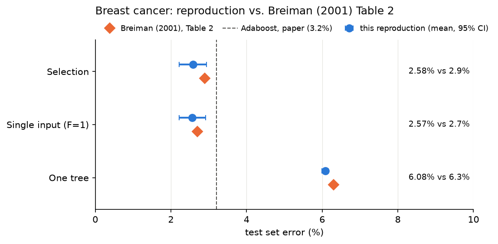
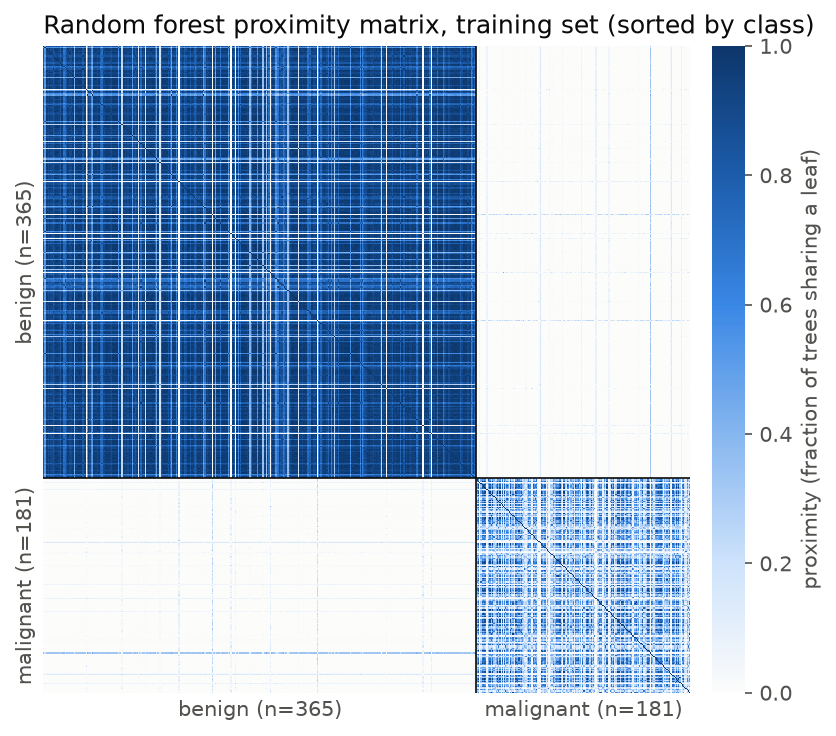
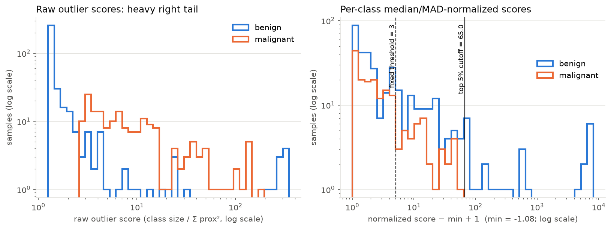
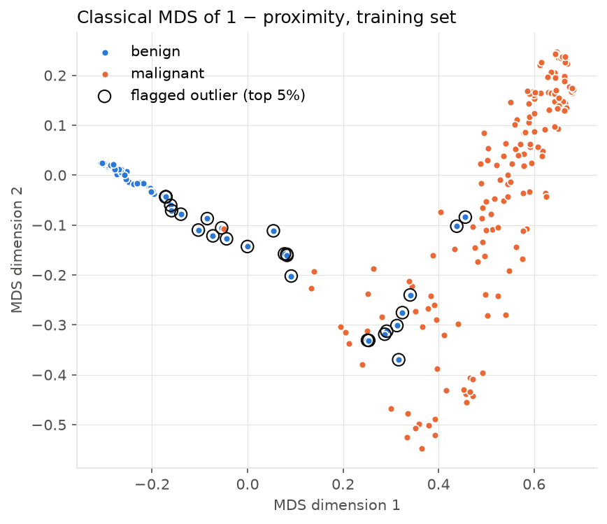

# Breiman Random Forest Reproduction

From-scratch implementation of Random Forests reproducing the core algorithmic
mechanisms of Breiman, L. (2001), *Random Forests*, Machine Learning, 45(1),
5–32. It is validated against the paper's Table 2 using the paper's own
evaluation protocol. The project is extended with a proximity-based outlier
measure. That measure comes from Breiman and Cutler's later Random Forests
documentation (Breiman, 2002); the 2001 paper doesn't discuss proximities.

This is a reproduction study and educational project, not a peer-reviewed
publication or a novel research contribution. The full write-up is in
[`REPORT.md`](REPORT.md).

## Overview

Implemented from first principles (NumPy only, no `sklearn.ensemble`):

1. **Bootstrap aggregation (bagging)**: each tree is trained on a bootstrap
   resample of the training data
2. **Random feature subsetting**: at every split, only `m` randomly chosen
   features are split candidates (default `m = ⌊√p⌋ = 3`)
3. **Out-of-bag (OOB) error estimation**: each training row is scored only by
   the trees that did not see it

Extension:

4. **Proximity-based outlier detection**: a forest-derived similarity matrix
   used to flag atypical samples within each class

Trees are CART-style: Gini impurity, fully grown (`max_depth=None`,
`min_samples_split=2`), unpruned.

## Repository structure

```
├── decision_tree.py     # Node, DecisionTree (Gini, fully grown), bootstrap_indices
├── random_forest.py     # Data loading, forest training, OOB error, test accuracy
├── proximity.py         # Proximity matrix + outlier scores (extension)
├── generate_plots.py    # Figures in figures/
├── paper_comparison.py  # Breiman (2001) §4 protocol vs. Table 2, plus comparison figure
├── results/             # Recorded outputs of the scripts above
├── figures/             # Proximity heatmap, outlier score histograms, MDS embedding
├── REPORT.md
├── requirements.txt
└── LICENSE              # MIT
```

## Dataset

**Breast Cancer Wisconsin (Original)**, UCI ML Repository, id=15
(Wolberg, 1990; DOI: 10.24432/C5HP4Z). It has 699 instances, 9 integer
features in the range 1–10, and 2 classes (458 benign, 241 malignant). The 16
rows with a missing *Bare Nuclei* value are dropped, which leaves 683.

Breiman (2001, Table 1) lists this dataset with 699 instances, 9 inputs and 2
classes. The paper doesn't say how the missing values were handled, so the
683-row evaluation set here is a documented deviation, not a match.

This is the *original* 9-feature WBC dataset, **not** the 30-feature
Wisconsin Diagnostic (WDBC) dataset bundled with
`sklearn.datasets.load_breast_cancer()`.

`load_wbc()` fetches the dataset through `ucimlrepo`. If the UCI API can't be
reached, it falls back to a GitHub mirror of the same file. The mirror was
checked against UCI's published statistics and against the independent CRAN
`mlbench` copy, and has identical features and labels. Each run prints which
source it used.

## Results

All numbers come from a single clean run of the final configuration
([`results/results.txt`](results/results.txt)): 100 trees, seed 42, and an
80/20 split (546 train, 137 test).

| Metric | Value |
|---|---|
| Bootstrap coverage (1000 trials) | 0.6321 (theoretical 1 − 1/e = 0.6321) |
| OOB error | **0.0293** (546/546 rows evaluated) |
| Forest test accuracy | **0.9635** (5/137 misclassified) |
| Single fully grown tree (all features) test accuracy | 0.9197 |
| Train misclassification (in-bag) | 0/546, expected for unpruned trees and not a performance metric |
| Proximity matrix | 546×546, diagonal exactly 1.0, symmetric |
| Mean proximity, same class / different class | 0.681 / 0.008 |
| Outliers flagged, normalized score > 3 | 153/546 (28.0%) |
| Outliers flagged, global top 5% | 28/546 (**all 28 benign**) |
| Outliers flagged, per-class top 5% | 19/365 benign, 9/181 malignant |

### Comparison with Breiman (2001), Table 2

[`paper_comparison.py`](paper_comparison.py) follows the paper's Section 4
protocol:

- 100 repetitions, each with a random 10% held out as a test set.
- 100-tree forests grown with `F = 1` and `F = int(log₂ 9 + 1) = 4`.
- The kept test error ("selection") comes from whichever of the two forests
  has the lower OOB error.

Results are in [`results/paper_comparison.txt`](results/paper_comparison.txt).

| Setting | This reproduction, mean % (SE) | Breiman (2001) Table 2, % |
|---|---|---|
| Forest-RI, selection | 2.58 (0.19) | 2.9 |
| Forest-RI, single input (F = 1) | 2.57 (0.18) | 2.7 |
| One tree (mean OOB error of individual trees) | 6.08 (0.04) | 6.3 |
| F = 4 only | 2.88 (0.19) | – |
| F = 3 (`⌊√p⌋`, the default elsewhere in this repo) | 2.70 (0.20) | – |
| Adaboost (not reimplemented) | – | 3.2 |

The same comparison is plotted in [Figure 1](#figure-1-reproduction-vs-breiman-2001-table-2).

A single 137-row test set gives accuracy in steps of 1/137 ≈ 0.73 percentage
points. The 100-repetition table is the result to cite; the single-split
numbers above are illustrative only.

Feature subsetting check (0-based feature index: root-split count over 100
trees):

- With `m = 3`, the root split uses 6 different features:
  `{1: 31, 2: 24, 4: 9, 5: 13, 6: 19, 7: 4}`.
- With `m = p = 9` (the control, no subsetting), the root split uses 3
  features, and one of them dominates: `{1: 81, 2: 18, 6: 1}`.

## Figures

All figures are generated from the recorded runs: Figure 1 by
`paper_comparison.py`, and Figures 2–4 by `generate_plots.py` (training set
of the seed-42 80/20 split, 546 rows, 100 trees, `m = 3`).

### Figure 1: Reproduction vs. Breiman (2001) Table 2



Test set error (%) on breast cancer under the paper's Section 4 protocol
(100 repetitions, 10% test set, 100 trees).

- **Blue circles:** mean over the 100 repetitions of this reproduction, with a
  95% confidence interval (±1.96 SE).
- **Orange diamonds:** the values published in Breiman (2001), Table 2.
- **Dashed line:** the paper's Adaboost error (3.2%), for reference.

The forest rows (selection, F = 1) both sit below the Adaboost line, and a
single tree is more than twice as error-prone as the forest, the same pattern
as the paper. The reproduction is a few tenths of a point lower in every row.
The paper values for selection and F = 1 fall inside the 95% intervals. The
one-tree interval is very narrow (6.00–6.16%), so its 0.22-point gap to the
paper's 6.3% is small but real.

### Figure 2: Proximity matrix



The 546 × 546 proximity matrix, with rows and columns sorted by class
(365 benign first, then 181 malignant). Each cell is the fraction of the 100
trees in which the two samples end up in the same leaf: 0 (white) means never,
1 (dark blue) means in every tree.

- The matrix is almost **block-diagonal**. Mean proximity is 0.681 within a
  class and only 0.008 between classes, so the forest almost never places a
  benign and a malignant sample in the same leaf.
- The **benign block is much denser** than the malignant one. Many benign
  samples have similar, low feature values and so reach the same leaves,
  while malignant samples are more varied.
- The pale lines crossing the benign block are benign samples that rarely
  share a leaf with the rest of their class. These are the outlier
  candidates examined in Figures 3 and 4.

### Figure 3: Outlier score distributions



Distribution of the proximity-based outlier score per class, on log–log axes.

- **Left, raw score** (`class size / Σ prox²` over same-class samples): both
  classes have a heavy right tail. Benign scores cluster tightly near their
  median (1.30), while malignant scores are spread much more widely (median
  6.47). The benign samples at the far right (≈350) are almost isolated:
  the most extreme one shares a leaf with only 14 of its 364 benign
  neighbours.
- **Right, per-class median/MAD-normalized score** (shifted by `− min + 1` so
  it fits a log axis). The dashed line is the fixed threshold of 3, and the
  solid line is the global top-5% cutoff (65.0).

The benign MAD (0.042) is about 78× smaller than the malignant MAD (3.32), so
normalization stretches benign scores far more than malignant ones. As a
result, the fixed threshold flags 28% of samples, and every sample above the
global top-5% cutoff is benign. The normalized scores are therefore not
comparable across classes on this dataset; a per-class cutoff is used
instead (see [`REPORT.md`](REPORT.md), §7.2).

### Figure 4: MDS embedding of the proximities



A 2-D map of the training set from classical (Torgerson) multidimensional
scaling of the dissimilarity `1 − proximity`: samples the forest often groups
together are drawn close to each other. Black circles mark the 28 samples in
the global top 5% of normalized outlier score.

- The first dimension **separates the classes**: benign samples (blue)
  collapse onto a tight arm on the left, and malignant samples (orange) form
  a wider cloud on the right.
- All flagged samples are benign. They lie away from the benign arm, towards
  or inside the malignant cloud, which fits their definition: benign cases
  the forest rarely groups with typical benign cases. Whether they are benign
  cases with malignant-like features is a hypothesis, not a tested result.

## Limitations

- The single-split numbers are noisy. Use the 100-repetition table.
- `m = ⌊√p⌋ = 3` (the later `randomForest` default) is used for the main run.
  The paper used `F = 1` and `F = 4`, and those are what
  `paper_comparison.py` uses.
- Rows with missing values are dropped (683 rows). The paper reports 699
  rows and doesn't describe how it handled the missing values.
- Adaboost is not reimplemented. Its 3.2% is quoted from the paper.
- Outlier scores are computed on the training set only. There is no
  test-set proximity cross-check.
- Per-class median/MAD normalization makes scores incomparable across
  classes on this dataset: the benign MAD is 0.042 and the malignant MAD is
  3.32. As a result, a global cutoff flags only benign samples.
- Proximity computation is O(n²) memory. That is tractable at n = 546, but
  larger n wasn't tested.

## Usage

```bash
pip install -r requirements.txt

python random_forest.py     # data, bootstrap check, OOB error, test accuracy (~3 s)
python proximity.py         # proximity matrix checks and outlier scores (~3 s)
python generate_plots.py    # writes figures/*.png
python paper_comparison.py  # Breiman (2001) protocol vs. Table 2 (~7 min)
```

## References

- Breiman, L. (2001). Random Forests. *Machine Learning*, 45(1), 5–32.
- Breiman, L. (1996). Bagging Predictors. *Machine Learning*, 24(2), 123–140.
- Breiman, L. (2002). *Manual on Setting Up, Using, and Understanding Random
  Forests V3.1*. Statistics Department, University of California, Berkeley.
- Wolberg, W. (1990). Breast Cancer Wisconsin (Original) [Dataset]. UCI
  Machine Learning Repository. https://doi.org/10.24432/C5HP4Z

## License

MIT
